## Lab 7 - Ingesting SAP OData into Microsoft Fabric Using Dataflow Gen2 and Data Pipelines

**Introduction:**

In this lab, you will create a new workspace, and ingest SAP OData data
into a Lakehouse using Dataflow Gen2. You will then build and run a data
pipeline to orchestrate the flow of data from the SAP OData source into
the Lakehouse. This lab helps you gain practical experience in setting
up end-to-end data ingestion and transformation processes within
Microsoft Fabric using low-code tools.

**Task 1: Create Workspace and Dataflow Gen2**

1.  Login to Azure portal at +++<https://portal.azure.com/+++> with your
    credentials.

    - Username **- <+++@lab.CloudPortalCredential>(User1).Username+++**

    - Password **- <+++@lab.CloudPortalCredential>(User1).Password+++**
&nbsp;

2.  From the Fabric homepage, click **+ New workspace**.

> 

3.  Enter the name Workspace_SAP and click **Apply**.

> 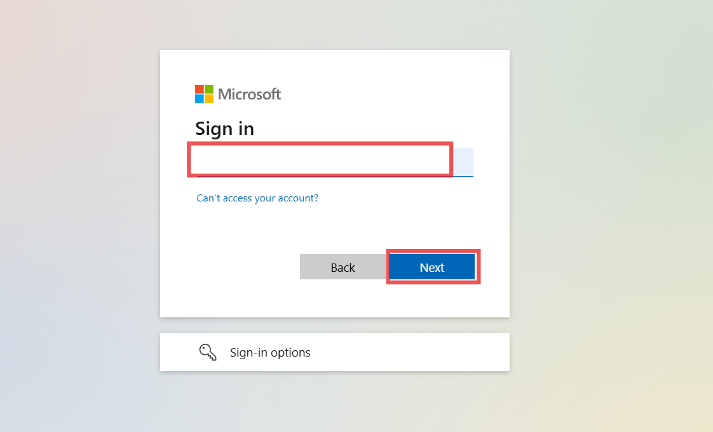

4.  Inside Workspace_SAP, click **+ New Item**.

5.  In the search bar, type **Dataflow**, then select **Dataflow Gen2**.

> 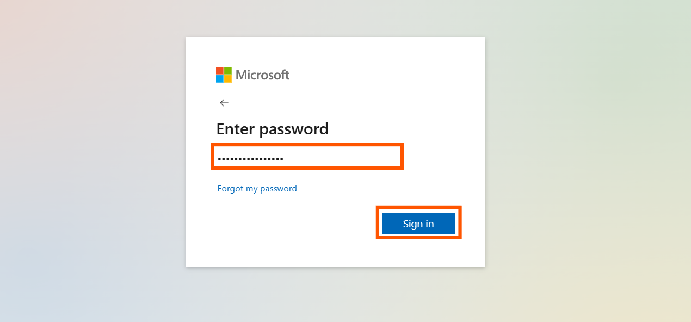

6.  Click the Dataflow 2 dropdown and enter the name of Dataflow as
    Dataflow_SAP.

> 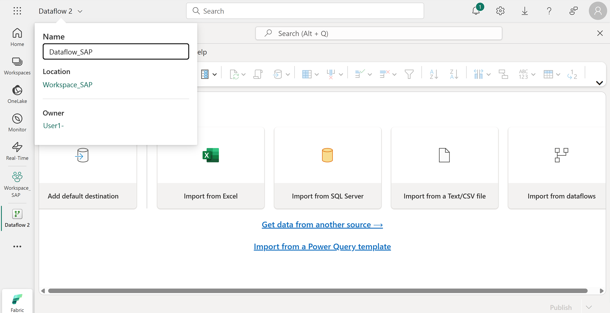

7.  Click **Get data from another source**.

> 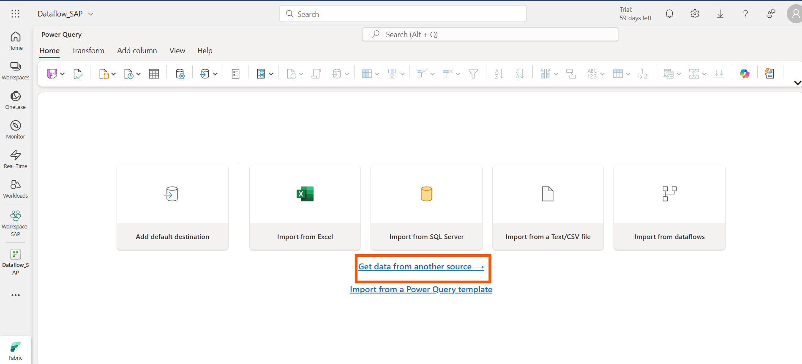

8.  In the search box, enter **OData** and select the **OData**
    connector.

> 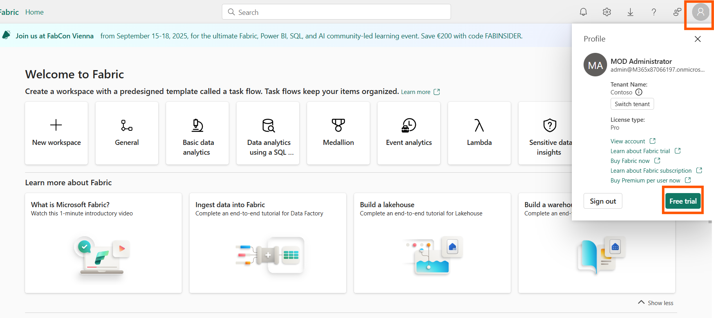

9.  Provide the following:

    - **URL**:
      <https://sapes5.sapdevcenter.com/sap/opu/odata/iwbep/GWSAMPLE_BASIC>

    - **Authentication**: Basic

    - **Username**: SAP P-user ID (from Lab 1)

    - **Password**: Corresponding P-user password

10.  Click **Next** to proceed.

> 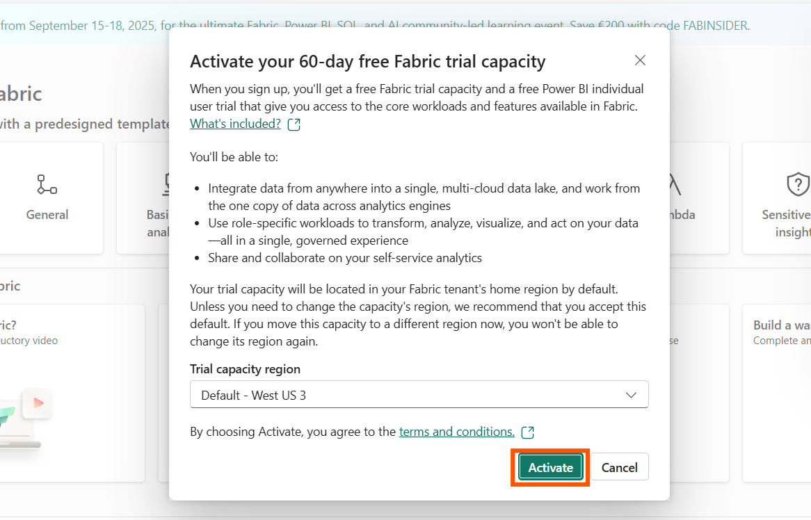

11. Select **ProductSet** table and click on the **create** button.

12. Select **Publish.**

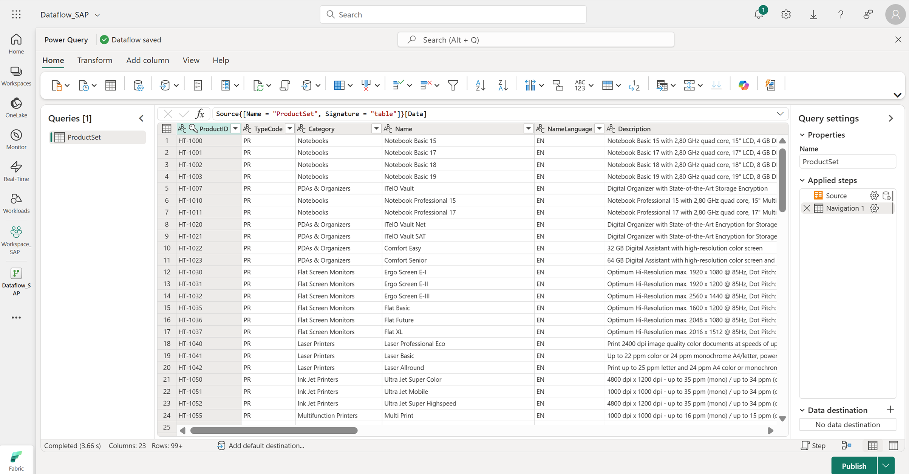

**Task 2: Create Lakehouse Destination**

1.  From the left menu, click Workspace_SAP to return to the workspace.

> 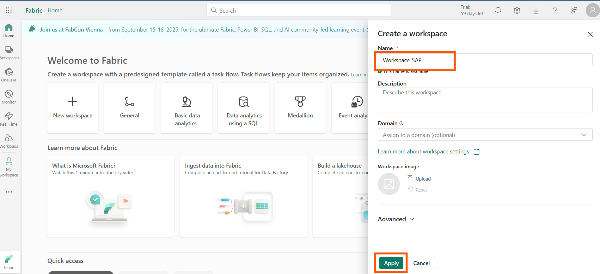

2.  Click **+ New Item**, search for **Lakehouse**, and select it.

> 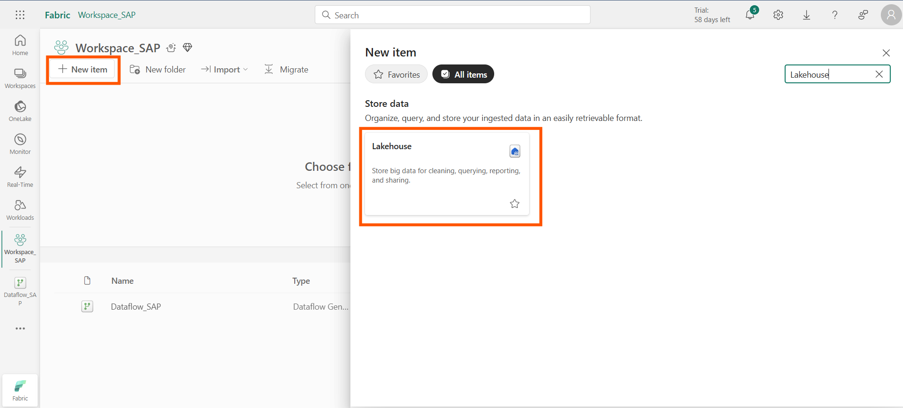

3.  Name it SAP_Lakehouse and click **Create**.

> 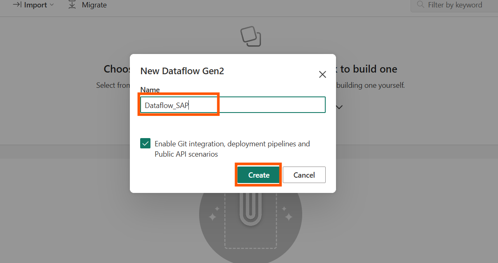

4.  Go back to Dataflow_SAP and open it.

> 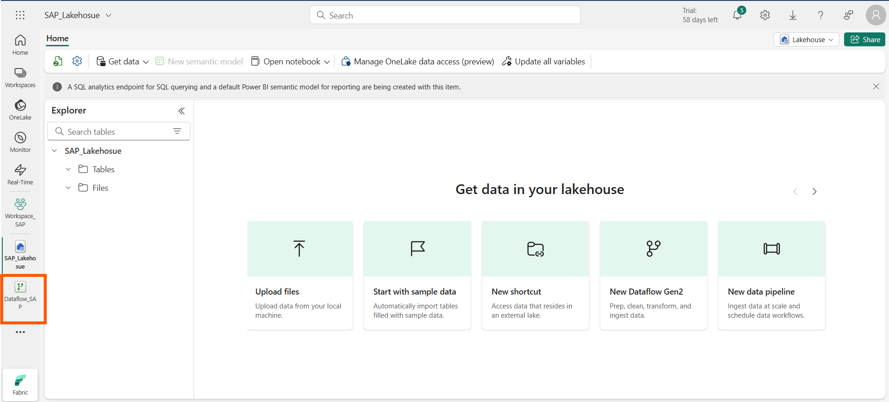

5.  From the bottom-right, click the **+ (Add data destination)** icon.

> 

6.  Select **Lakehouse** as the destination.

> 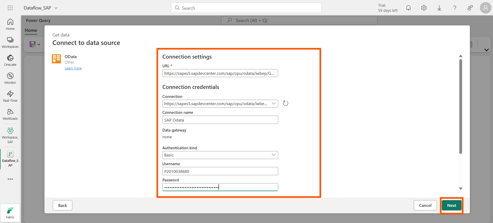

7.  In the **Connection name** field, enter SAPLakehouse, then click
    **Next**.

> 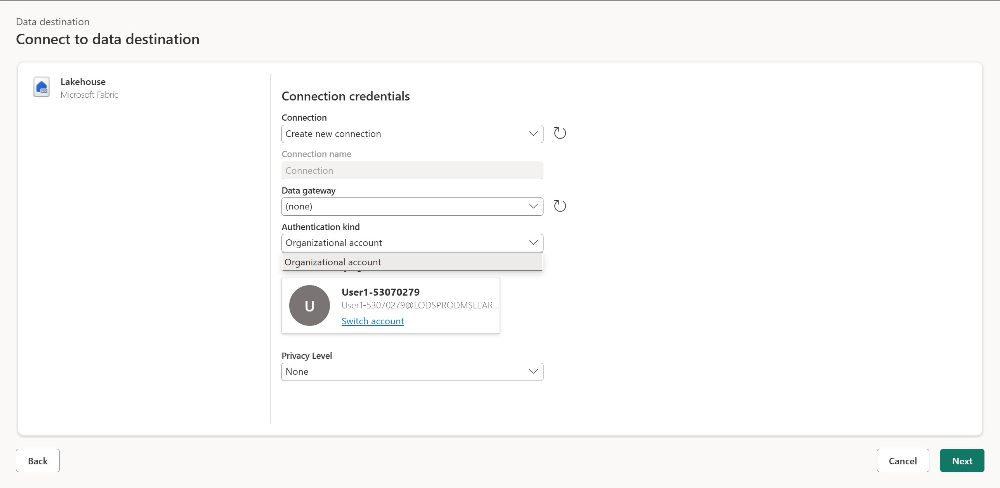

8.  Select Workspace_SAP → SAP_Lakehouse, then click **Next**.

> 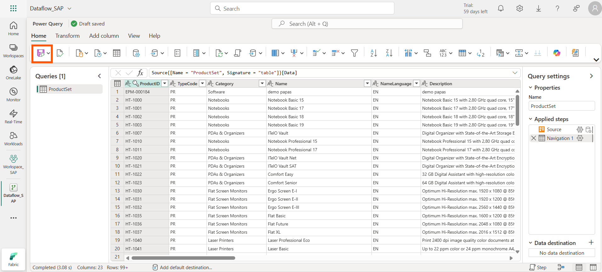

9.  Turn off **Use automatic settings**.

10. Choose the **Append** option and click **Save settings**.

> 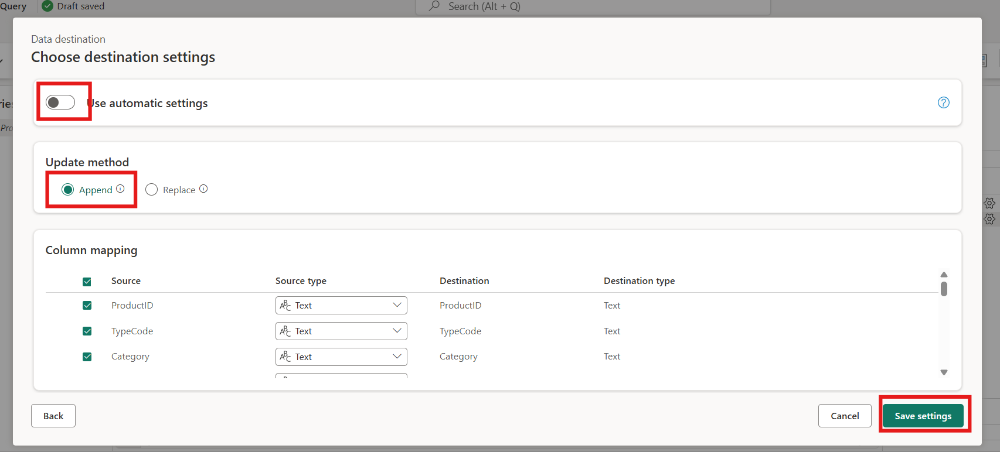

11. Click **View** → **Diagram view** to visualize the flow and confirm
    the Lakehouse is connected.

> 

12. Navigate to the **Home page** and select **Publish**.

> 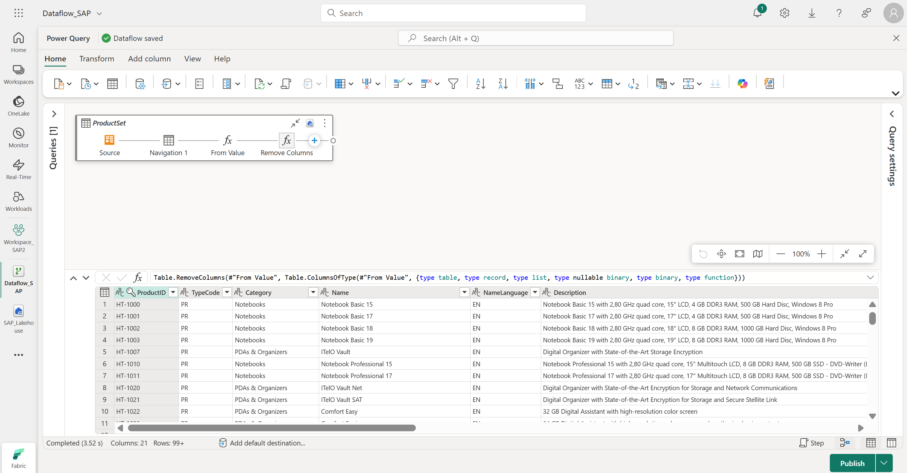

------------------------------------------------------------------------

**Task 3: Create and Execute Data Pipeline**

1.  Return to Workspace_SAP.

> 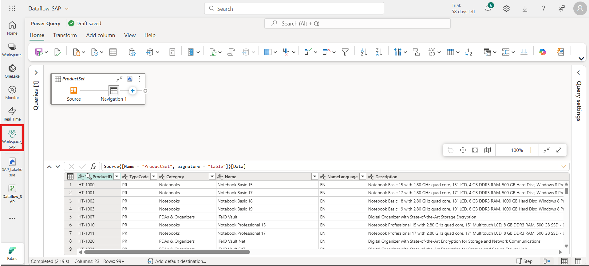

2.  Click **+ New Item**, search for **Data pipeline**, and select it.

> 

3.  Name the pipeline **pipeline_sap** and click **Create**.

> 

4.  Click on Pipeline activity, In the activity pane, select the
    **Dataflow** activity.

> 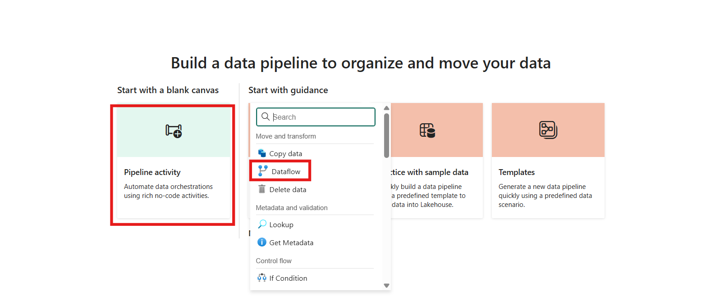

5.  Go to **Settings**, click on the **Dataflow** field, and choose
    Dataflow_SAP.

> 

6.  Click **Run** to execute the pipeline.

> 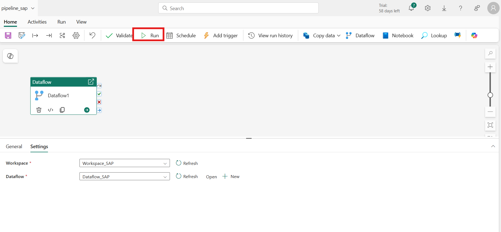

7.  Click **Save and Run**.

> 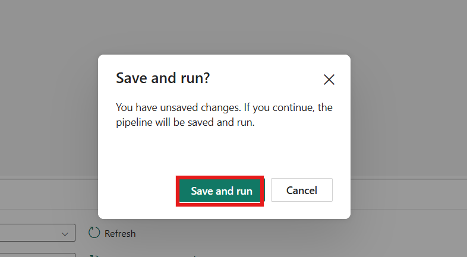

8.  Wait until the **Activity Status** shows **Succeeded**, confirming
    successful execution.

> 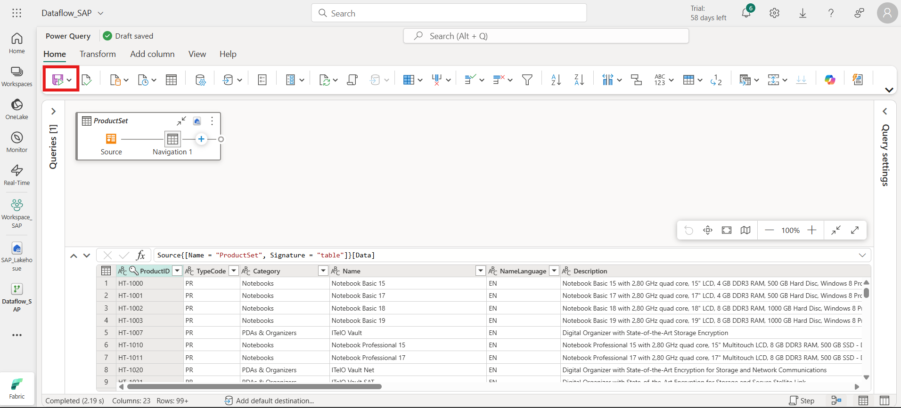

**Conclusion:**

By completing this lab, you have created a workspace, and configured a
Dataflow Gen2 to connect to SAP OData services. You also built a
Lakehouse destination and a Data Pipeline to orchestrate and manage data
ingestion from SAP into Fabric. This hands-on experience demonstrates
how Microsoft Fabric simplifies enterprise data integration and
processing using low-code tools for SAP and other enterprise systems.
