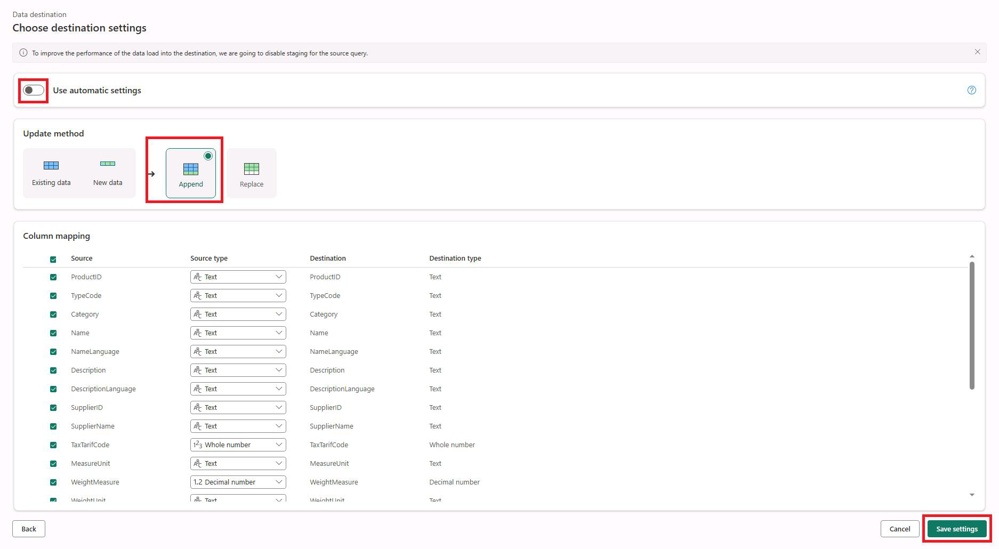
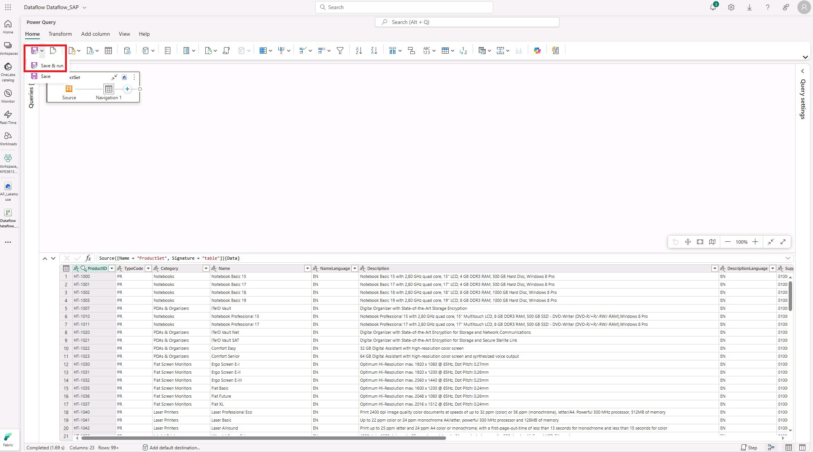
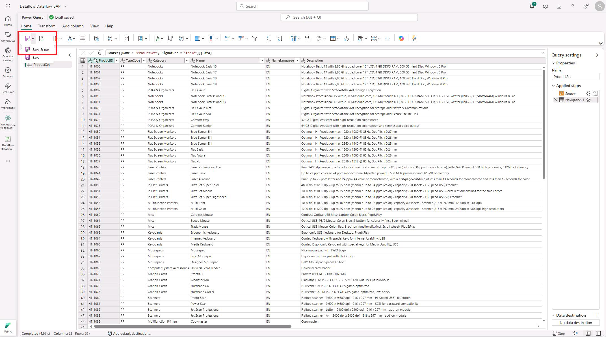
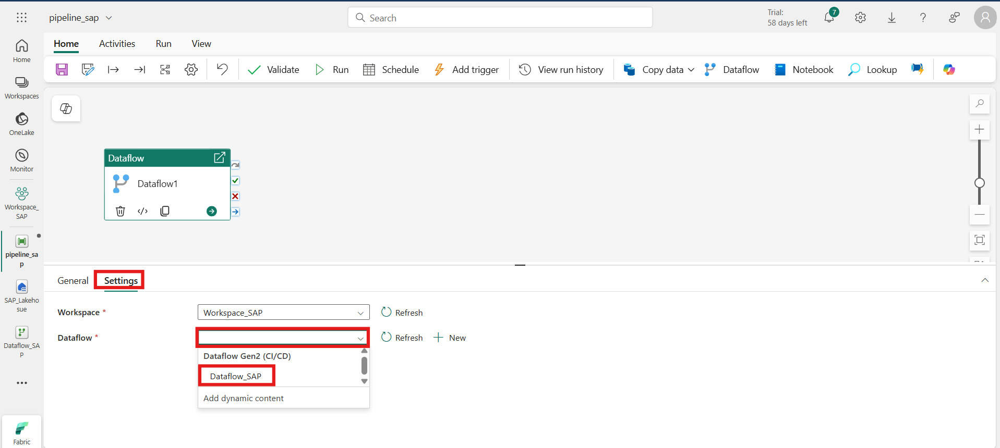
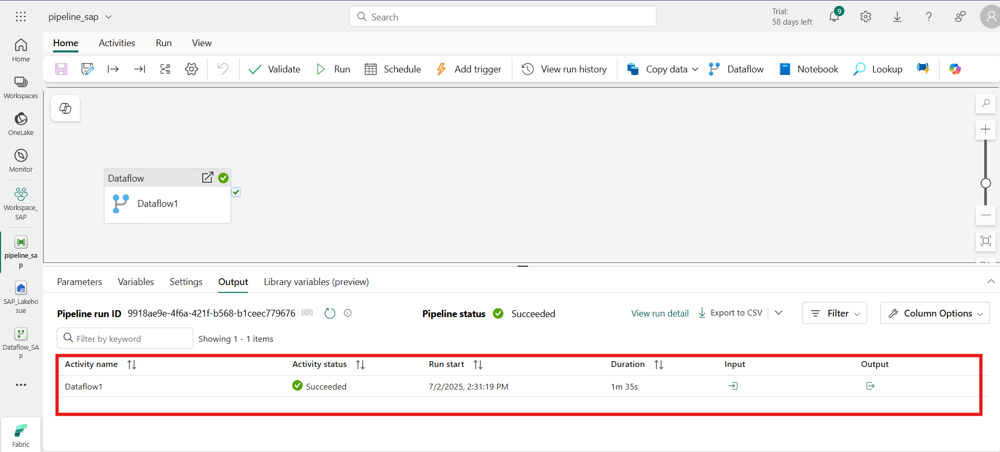

## Lab 7 - Ingesting SAP OData into Microsoft Fabric Using Dataflow Gen2 and Data Pipelines

**Introduction:**

In this lab, you will activate a Microsoft Fabric trial, create a new
workspace, and ingest SAP OData data into a Lakehouse using Dataflow
Gen2. You will then build and run a data pipeline to orchestrate the
flow of data from the SAP OData source into the Lakehouse. This lab
helps you gain practical experience in setting up end-to-end data
ingestion and transformation processes within Microsoft Fabric using
low-code tools.

**Task 1: Activate Microsoft Fabric Free Trial**

1.  Open the Edge browser and navigate to the Microsoft Fabric Portal
    (<https://www.microsoft.com/en-us/microsoft-fabric/getting-started>).

2.  Click **Try for free** to start your 60-day trial.

> 

3.  On the sign-in screen:

    - Enter your **Microsoft 365 Admin email (tenant ID)** and click
      **Next**.

> 

- Enter your **password** and click **Sign in**.

> 

- Click **Yes** when prompted to stay signed in.

> 

4.  Close the pop-up window by clicking the **X (cross)** icon.

> 

5.  Click your **profile icon** (top-right corner), then click **Free
    trial**.

> 

6.  Click the **Activate** button.

> 

7.  After successful activation, click **Got it**.

> 

**Task 2: Create Workspace and Dataflow Gen2**

1.  From the Fabric homepage, click **+ New workspace**.

> 

2.  Enter the name Workspace_SAP and click **Apply**.

> 

3.  Inside Workspace_SAP, click **+ New Item**.

4.  In the search bar, type **Dataflow**, then select **Dataflow Gen2**.

> 

5.  Enter the name Dataflow_SAP and click **Create**.

> 

6.  Click **Get data from another source**.

> 

7.  In the search box, enter **OData** and select the **OData**
    connector.

> 

8.  Provide the following:

    - **URL**:
      https://sapes5.sapdevcenter.com/sap/opu/odata/iwbep/GWSAMPLE_BASIC

    - **Connection Name**: SAP OData

    - **Authentication**: Basic

    - **Username**: SAP P-user ID (from Lab 1)

    - **Password**: Corresponding P-user password

9.  Click **Next** to proceed.

> 

10. Select **ProductSet** table and click on the **create** button.

11. Participant can use Power Query if transformation is required, For
    this lab guide we are not transforming data click on **Save
    button**.

> 

**Task 3: Create Lakehouse Destination**

1.  From the left menu, click Workspace_SAP to return to the workspace.

> 

2.  Click **+ New Item**, search for **Lakehouse**, and select it.

> 

3.  Name it SAP_Lakehouse and click **Create**.

> 

4.  Go back to Dataflow_SAP and open it.

> 

5.  From the bottom-right, click the **+ (Add data destination)** icon.

> 

6.  Select **Lakehouse** as the destination.

> 

7.  In the **Connection name** field, enter SAPLakehouse, then click
    **Next**.

> 

8.  Select Workspace_SAP → SAP_Lakehouse, then click **Next**.

> 

9.  Turn off **Use automatic settings**.

10. Choose the **Append** option and click **Save settings**.

> 

11. Click **View** → **Diagram view** to visualize the flow and confirm
    the Lakehouse is connected.

> 

12. Click **Home** → **Save and Run** to execute the dataflow.

> 

------------------------------------------------------------------------

**Task 4: Create and Execute Data Pipeline**

1.  Return to Workspace_SAP.

> 

2.  Click **+ New Item**, search for **Data pipeline**, and select it.

> 

3.  Name the pipeline **pipeline_sap** and click **Create**.

> 

4.  Click on Pipeline activity, In the activity pane, select the
    **Dataflow** activity.

> 

5.  Go to **Settings**, click on the **Dataflow** field, and choose
    Dataflow_SAP.

> 

6.  Click **Run** to execute the pipeline.

> 

7.  Click **Save and Run**.

> 

8.  Wait until the **Activity Status** shows **Succeeded**, confirming
    successful execution.

> 

**Conclusion:**

By completing this lab, you’ve successfully activated Microsoft Fabric,
created a workspace, and configured a Dataflow Gen2 to connect to SAP
OData services. You also built a Lakehouse destination and a Data
Pipeline to orchestrate and manage data ingestion from SAP into Fabric.
This hands-on experience demonstrates how Microsoft Fabric simplifies
enterprise data integration and processing using low-code tools for SAP
and other enterprise systems.
